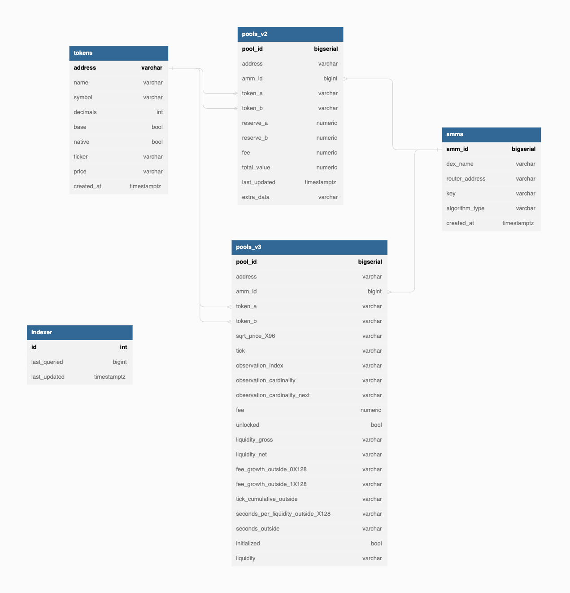

# pickaxe (continutes to be developed)

Indexer of the Starknet AMM pools written in Golang - to be used in [Fibrous](https://fibrous.finance)


*sister of [Shovel](https://github.com/tahos81/shovel) NFT Indexer*

<hr/>

Preperation to build

``` bash
// Create Docker container for Postgres
make postgres

// Creates database in the container
make createdb

// Create database tables
make migrateup

// To install the app (preferred)
make install-go

// To build Go code (optional)
make build
```

Run the app directly

``` bash
// Run the socket block finder (basic version)
make psocket

// Run the app (basic version)
make pickaxe

// Run the app (if the app has been installed)
pickaxe

// Run the socket (if the app has been installed)
psocket

// Run the app (if the code has been built)
./bin/pickaxe

// Run the socket (if the code has been built)
./bin/psocket

// For testnet envs - run with testnet flag, example:
pickaxe -t
pickaxe --testnet
```

Run the app in docker network

``` bash
// Create the docker network
make docker-network

// Run the postgres server
make postgres-network

// Build the app containers
make docker-build-psocket
make docker-build-pickaxe

// Create & run the app containers
make docker-container-psocket
make docker-container-pickaxe
```

Run the app with docker-compose


``` bash
// Create the docker compose network
make docker-compose
```

Notes:
* You should prepare a initial tokens - pools list for the initial run. The indexer will accept this point as a synced point. Example ones below:
  * [amms](./db/init/amms.json)
  * [tokens](./db/init/tokens.json)
  * [pools](./db/init/pools.json)

<hr/>

Requirements & Tools
* [Go](https://go.dev/)
* [dbml](https://dbml-lang.org)
* [docker](https://docker.com/)
* [golang-migrate](https://github.com/golang-migrate/migrate)
* [caigo](https://github.com/dontpanicdao/caigo)
  * [caigo-rpcv02](https://github.com/ulerdogan/caigo-rpcv02) (customized rpcv02 of caigo for pickaxe)
* [gocron](https://github.com/go-co-op/gocron)
* [sqlc](https://sqlc.dev/)

<hr/>

Check the database tables in [DBDocs](https://dbdocs.io/ulerdogan/Pickaxe).

